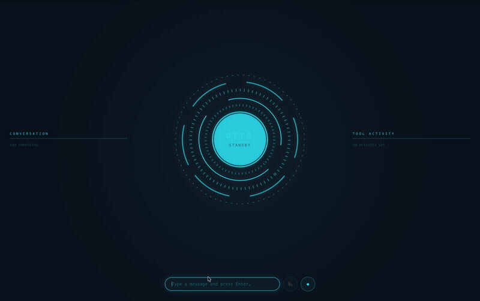

# Otto

A voice and text AI assistant that runs on my own machine. It reads my screen, searches the web, manages files, runs code, and remembers things about me between sessions. Every risky action gets shown to me for approval before it happens.

> macOS only for now. Still actively working on it.



## Why I built this

Most "AI assistant" projects stop at a chatbot that talks back. The part I found actually interesting wasn't the voice. It was figuring out how to give a language model real access to my computer without that being a terrible idea.

So the project ended up being mostly about that:

- **The tool-calling loop is written from scratch** against the raw HTTP API instead of an SDK, so I actually understand what's happening rather than trusting a wrapper.
- **Tiered permissions.** Read-only stuff runs instantly. Anything that changes state asks me first.
- **Directory scoping.** It can only write or delete inside folders I've explicitly allowed. Deletes go to the Trash so I can undo them.
- **Guards that run before the prompt.** Genuinely dangerous operations get refused outright rather than shown to me as something to approve. Otherwise I'd just get used to clicking Allow.
- **Audit log.** Every tool call, its arguments, and what happened, saved to disk.
- **Swappable LLM backends.** Fully local and offline with Ollama, or Groq when I want speed. One line in `.env`.

## Interface

Everything happens in a browser HUD: typing, push to talk, permission prompts, and a live feed showing every tool it uses as it uses them.

## How it's put together

```
Browser HUD  ──HTTP──▶  hud_server.py
                            │
                            ▼
                        main.py  ──▶  voice.py (Whisper STT)
                            │     ──▶  speech.py (macOS say)
                            ▼
                       assistant.py
                       ├─ guards.py      refuse before prompting
                       ├─ scope.py       which dirs are writable
                       ├─ audit.py       log every call
                       ├─ memory.py      persistent facts + auto extraction
                       ├─ backends/llm.py    Ollama or Groq
                       └─ tools/         the things it can actually do
```

The registry in `src/tools/__init__.py` is the one place that defines what tools exist, what the model gets told about them, and which ones need permission. Adding a tool means writing a function and a schema, then registering it in three spots. The core loop never changes.

## Tools

| Tool | Permission | What it does |
|---|---|---|
| `read_file` | auto | Read a text file |
| `list_directory` | auto | List a directory |
| `write_file` | ask | Create or overwrite a file (scoped) |
| `delete_file` | ask | Move a file to the Trash (scoped) |
| `run_shell_command` | ask | Run a shell command |
| `run_python` | ask | Run Python in a throwaway temp directory |
| `read_screen` | auto | Screenshot the active window and OCR the text |
| `search_web` | auto | Web search through Tavily |
| `get_current_datetime` | auto | Current date and time |
| `remember` / `recall` | auto | Long term memory |
| `forget` | ask | Delete stored memories |

## Setup

You'll need macOS, Python 3.12+, and [Homebrew](https://brew.sh).

```bash
git clone https://github.com/MateenM10/otto-assistant.git
cd otto-assistant

python3 -m venv .venv
source .venv/bin/activate
pip install -r requirements.txt

brew install tesseract          # OCR engine for reading the screen

cp .env.example .env            # then put your own API keys in it
python -m src.main
```

Open the HUD at whatever URL it prints, then type or hit the mic button.

**Keys you'll need.** Both have free tiers and neither asks for a card:
- [Groq](https://console.groq.com) for the LLM. Skip it if you'd rather run Ollama.
- [Tavily](https://tavily.com) for web search.

**Running it fully local.** Install [Ollama](https://ollama.com), run `ollama pull llama3.2:3b`, and set `LLM_BACKEND=ollama`. No API key, nothing leaves your machine. It's slower and worse at tool calling, but it works offline.

**Screen reading needs permission.** System Settings → Privacy & Security → Accessibility, add your terminal or VS Code, then restart it.

## Stuff I figured out along the way

**Small models fake tool calls.** Running locally on a 3B model, it would sometimes just print `{"name": "read_screen", "parameters": {}}` as text instead of actually calling the tool, sometimes with broken JSON. `_try_parse_fake_tool_call` in `assistant.py` catches that and recovers it. I made the JSON parsing deliberately loose because strict parsing failed on exactly the cases I was trying to rescue.

**Blocking one path doesn't block anything.** I added guards to `run_python` to stop it deleting files. It hit the block, then immediately ran `rm` through `run_shell_command` and deleted the file anyway. A guard on one tool is useless while a more permissive tool sits right next to it, so the guards now live in one shared module that covers every route.

**I was wrong about OCR preprocessing.** I assumed thresholding (forcing every pixel to black or white) would help Tesseract read screen text. I tested four variants on the same screenshot and it came out *worst* of the four. It wrecks the anti aliased edges that OCR uses to recognize letters. Plain grayscale plus upscaling won by a lot.

**Prompting doesn't replace code.** I told the model in the system prompt to ignore OCR noise. It ignored me and dumped the garbage back anyway. Filtering the noise in `vision_tools.py` before the model ever saw it fixed it instantly.

**Model names go stale fast.** `llama-3.3-70b-versatile` gave me a 404 because Groq had retired it. Now I check `/v1/models` instead of trusting a name I read somewhere.

## What's next

- [x] Tool calling with file and shell access
- [x] Voice in (Whisper) and out
- [x] Permissions, audit log, dry run mode
- [x] Screen reading with OCR
- [x] Memory that persists and builds itself
- [x] Browser HUD with live tool activity
- [x] Swappable local and cloud backends
- [x] Web search
- [ ] Wake word
- [ ] Make it work on Linux and Windows
- [ ] Calendar and email